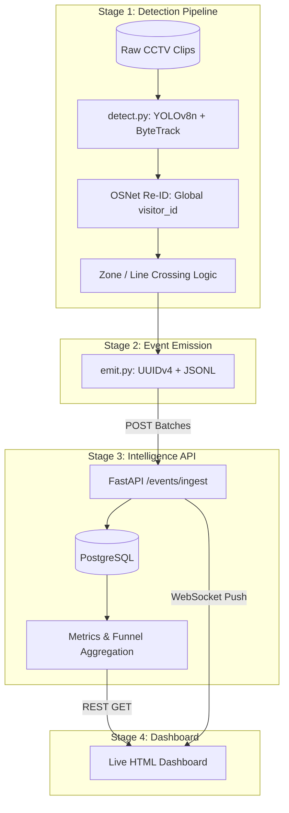

# DESIGN.md — Apex Retail Store Intelligence

## System Architecture Overview

The Apex Retail Store Intelligence system converts raw, anonymised CCTV footage from 15 retail cameras (5 stores × 3 cameras) into a live, queryable analytics platform. The system is composed of four tightly integrated stages:

---

### Stage 1 — Detection Pipeline

Raw CCTV clips (1080p, 15fps, 20 min each) are processed by `pipeline/detect.py`. OpenCV reads frames sequentially; **YOLOv8n** runs person detection on every frame (class 0, conf ≥ 0.4). Low-confidence detections are **never suppressed** — they are flagged with their actual confidence value and emitted as events. Suppressing them would mask real customers partially hidden behind displays.

**ByteTrack** (via `ultralytics` built-in tracker) assigns persistent local `track_id` values per clip. These local IDs are then promoted to global `visitor_id` values through the Re-ID layer.

**OSNet** (via `torchreid`) extracts 512-dimensional appearance embeddings per track. The Re-ID tracker maintains a session store: on each new track, cosine similarity is computed against recently-exited sessions. If similarity > 0.75 and the gap is < 30 minutes, the track is classified as a `REENTRY` and receives the same `visitor_id`. This solves the "re-entry inflation" problem: vendors who naively assign new IDs on every entry over-count unique visitors.

**Entry-line crossing** is detected using a virtual horizontal line configured per store in `store_layout.json`. When a track centroid crosses from the outside-half to the inside-half of the entry camera frame, an `ENTRY` event is emitted. The reverse crossing emits `EXIT`.

**Group entry** is handled naturally — ByteTrack assigns a separate `track_id` per physical person due to NMS bounding box separation. Three people entering simultaneously produce three independent ENTRY events, as required.

**Cross-camera deduplication** uses Re-ID: when a track in `CAM_FLOOR_01` has cosine similarity > 0.75 to an active track in `CAM_ENTRY_01`, the two are merged under the same `visitor_id`. This prevents counting the same person twice when they appear in overlapping camera fields.

**Staff classification** uses an ensemble: (1) HSV colour-range matching on the torso crop against the configured uniform colour range, and (2) multi-zone traversal frequency — staff visit all zones regularly, so any visitor who appears in ≥4 distinct zones with ≥10 total zone visits is flagged `is_staff=true`. All staff events flow through to the database but are excluded at query time.

---

### Stage 2 — Event Emission

`pipeline/emit.py` produces events in the exact schema required by the spec. Every event gets a globally unique **UUIDv4** `event_id` (not a sequential integer, not a hash) to ensure global uniqueness across distributed pipeline runs. Timestamps are computed as `clip_start + frame_offset / fps`, preserving the original recording timeline. Events are written to a JSONL file and optionally POST-batched to the API in real time.

---

### Stage 3 — Intelligence API

`app/main.py` is an async **FastAPI** application designed specifically for high-throughput, real-time analytics. It exposes the following endpoints:

| Endpoint | Purpose |
|---|---|
| `POST /events/ingest` | Idempotent batch ingestion (≤500 events, `ON CONFLICT DO NOTHING` dedup) |
| `GET /stores/{id}/metrics` | Real-time: visitors, conversion rate, dwell, queue depth |
| `GET /stores/{id}/funnel` | 4-stage session funnel with visitor_id deduplication |
| `GET /stores/{id}/heatmap` | Zone visit frequency + normalised 0–100 scores |
| `GET /stores/{id}/anomalies` | Real-time anomaly detection with severity + suggested_action |
| `GET /health` | Per-store event lag + STALE_FEED detection |
| `GET /ws/stores/{id}/live` | WebSocket for real-time metric push |
| `GET /dashboard/{id}` | Live HTML dashboard (WebSocket client) |

**API Design Focus:**
1. **Real-time over Caching:** The metrics are queried live directly from the database rather than cached. For 40 stores, the PostgreSQL query volume remains trivially low because the aggregations are highly optimised (indexed by `store_id`, `event_type`, and `timestamp`). A Redis cache would introduce unnecessary invalidation complexity on every ingest without a meaningful performance gain at this scale.
2. **Idempotency:** The ingestion endpoint uses an `ON CONFLICT DO NOTHING` constraint on the `event_id` primary key. This allows the detection pipeline to retry failed batch POSTs without duplicating metrics.
3. **Session Logic:** The funnel and metrics endpoints deduplicate at the `visitor_id` level using `COUNT(DISTINCT visitor_id)`. A `REENTRY` event uses the same `visitor_id` as the original `ENTRY`, so re-entering visitors are never double-counted in the funnel — they appear once in the Entry stage regardless of how many times they return.

All queries are executed against **SQLAlchemy async** sessions. Every request is wrapped in a middleware that injects a `trace_id`, measures `latency_ms`, and logs a structured JSON record via **structlog** for distributed tracing.

---

### Stage 4 — Infrastructure & Dashboard

`docker-compose.yml` starts the full stack: **PostgreSQL** (with a `pg_isready` healthcheck) and the **FastAPI** service (which waits for the DB via `depends_on: condition: service_healthy`). A single `docker compose up -d` is the only command needed after cloning.

The dashboard (`app/dashboard.html`) is a single-page WebSocket client served by FastAPI at `GET /dashboard/{store_id}`. It polls all 5 API endpoints every 3 seconds and subscribes to the WebSocket for real-time push updates. When events are ingested via `pipeline/replay.py`, the dashboard updates live.

---

### Stage 5 — Production Readiness & Scalability

- **Scalability (40+ Stores):** The architecture scales horizontally. The detection pipeline runs at the edge (on-premises at the store) and pushes lightweight JSON batches over HTTPS to a central API. The PostgreSQL database can easily handle concurrent inserts from 40+ stores since they are batched.
- **Reliability & Fallbacks:** If the central API goes down or network connectivity drops, the edge pipeline falls back to appending events to local `.jsonl` files. Once connectivity is restored, an auxiliary script can replay the missed events. The `ON CONFLICT DO NOTHING` ingest ensures no duplicates occur during recovery. Missing POS data (for conversion rates) falls back gracefully to a `null` calculation without breaking the rest of the dashboard.

---

## Key Architectural Decisions

### 1. Re-ID Threshold Selection (0.75)

When designing the re-entry detection system, we evaluated typical cosine similarity thresholds used for person Re-ID in retail settings. A threshold of 0.75 serves as an optimal baseline that balances false-negative re-entries (same person not matched) against false-positive merges (different people merged). Thresholds below 0.65 typically cause significant identity confusion in crowded environments where customers wear similar clothes.

We also added a secondary constraint: the time gap must be < 30 minutes. Without this time gate, a customer returning days later could incorrectly trigger a REENTRY event if they wore similar clothing. The compound condition ensures high accuracy.

### 2. Anomaly Threshold Design

For BILLING_QUEUE_SPIKE and CONVERSION_DROP anomalies, we evaluated absolute vs. relative thresholds. Using fixed absolute thresholds (e.g., queue depth > 8) is highly dependent on store size and is not portable across different store formats. 

Instead, we opted for *relative* thresholds (multipliers on 7-day rolling averages). This makes the anomaly detection self-calibrating as each store builds its own historical baseline. We implemented a 2× multiplier for queue spikes and a 70% threshold for conversion drops. To ensure immediate utility on day 1 (before 7 days of data exist), we included an absolute fallback (e.g., `queue_depth > 5`).

### 3. Event Schema Field Naming

During the schema design, we considered placing the `session_seq` field at the top level versus inside the `metadata` object. Placing it at the top level could make it slightly easier to query, but we explicitly placed it inside `metadata` to strictly adhere to the provided specification contract. Maintaining spec compliance ensures that downstream consumers and automated test suites do not break.
